# Lotline — UI/UX Flow Map

> Source: Lotline Product Requirements Document, Version 0.1 (15 November 2026).
> Purpose: a single, renderable map of every screen, the navigation between them, and the user flows that pass through them. All diagrams are Mermaid so they render inline in GitHub, GitLab, VS Code, Obsidian, Typora, and any modern Markdown preview.
> Governing principle to keep in view on every screen: **AI proposes defects. Humans confirm defects. The deterministic sampling engine makes the recommendation. The AI never independently approves a lot.**

---

## 1. How to read this file

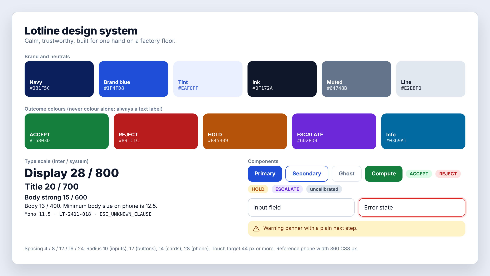

Visual style is defined in `UI_UX_DESIGN.md` (tokens, components, rules). Mockup images below follow it.

This file is the navigation/flow companion to the PRD. It does not restate requirements; it shows how a user moves through the product.

- **Section 2** — Roles at a glance (who can go where).
- **Section 3** — The global screen map: one diagram of all 13 screens and their primary links.
- **Section 4** — Per-screen cards: purpose, primary user, components, actions, validation/empty states, and the screens each action leads to (the 13 screens from PRD section 15).
- **Section 5** — End-to-end user flows as Mermaid `flowchart` diagrams (W-01 to W-16 from PRD section 8).
- **Section 6** — The decision engine flow (PRD section 9.7) and the failure/edge-case matrix as a flow (PRD section 16).
- **Section 7** — Phone-first UX rules and the cross-cutting labels every screen must show.

Notation in flow diagrams:
- `[ ]` = a screen / page
- `{ }` = a decision
- `(( ))` = an external system / host operator action
- `( )` = an action / step
- Solid arrows = the primary happy path
- Dashed arrows (`-.->`) = an alternative, error, or fallback path

---

## 2. Roles at a glance

Roles are **single** per user and enforced server-side (PRD 5, AZ-02). Version 1 has one organization and ~25 users.

| Role | Home screen they land on | Can go to (read) | Can change |
|---|---|---|---|
| **Admin** | **Admin Panel** (tabbed hub: Users, Audit, Products & Buyers, Model versions, System health, Backup) | Dashboard, Lot list, Lot details (no garment images), Report view, Admin Panel | Users, products, buyers, model activation (on host), reads & exports audit log, watches system health |
| **Inspector** | Dashboard | Dashboard, Lot list, Lot details, Image capture, Image review, Defect confirmation, Decision summary, Report view | Lots they created, images on their lots, defect confirmations, decisions on their lots, reports for their lots |
| **Supervisor** | Dashboard | Everything an Inspector sees, plus Sampling plan config and Audit log (Admin Panel → Audit tab, read-only; export is Admin-only) | Everything an Inspector can change on any lot, plus sampling plans, overrides, image withdrawal, audit log read, archive |

A role never sees a button for an action it cannot perform; the server still enforces the permission (AZ-02). Denied requests return 401/403/404 and write a denied audit row (AZ-13).

---

## 3. Global screen map

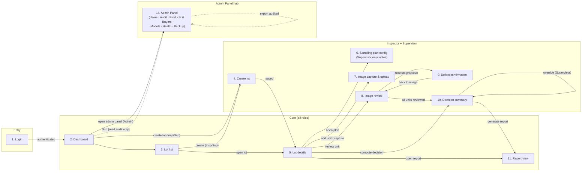
```mermaid
flowchart LR
  subgraph Entry["Entry"]
    L["1. Login"]
  end

  subgraph Core["Core (all roles)"]
    D["2. Dashboard"]
    LL["3. Lot list"]
    LD["5. Lot details"]
    RV["11. Report view"]
  end

  subgraph Inspector["Inspector + Supervisor"]
    CL["4. Create lot"]
    SP["6. Sampling plan config\n(Supervisor only writes)"]
    CAP["7. Image capture & upload"]
    IR["8. Image review"]
    DC["9. Defect confirmation"]
    DS["10. Decision summary"]
  end

  subgraph Admin["Admin Panel hub"]
    AP["14. Admin Panel
(Users · Audit · Products & Buyers
· Models · Health · Backup)"]
  end

  L -->|authenticated| D
  D --> LL
  D -->|"create lot (Insp/Sup)"| CL
  D -->|"open admin panel (Admin)"| AP
  LL -->|open lot| LD
  LL -->|"create (Insp/Sup)"| CL
  CL -->|saved| LD
  LD -->|open plan| SP
  LD -->|add unit / capture| CAP
  LD -->|review unit| IR
  LD -->|compute decision| DS
  LD -->|open report| RV
  IR -->|confirm/edit proposal| DC
  DC -->|back to image| IR
  IR -->|all units reviewed| DS
  DS -->|generate report| RV
  DS -->|"override (Supervisor)"| DS
  AP -->|Users tab| AP
  AP -->|Audit tab| AP
  AP -->|Products & Buyers tab| AP
  AP -->|Models tab| AP
  AP -->|Health tab| AP
  AP -->|Backup tab| AP
  AP -.->|"activate model (on host)"| AP
  AP -.->|export audited| AP
  D -.->|"Sup (read audit only)"| AP
```

---

## 4. Screen cards (1–14)

Each card lists the PRD screen number, its purpose, the primary user, main components, the actions available, the validation / empty states, and — what makes this a **flow** map — the screen each action leads to. Screen 14 (Admin Panel) consolidates the old User management and Audit log screens and adds the system-administration tabs the PRD placed elsewhere.

### Screen 1 — Login

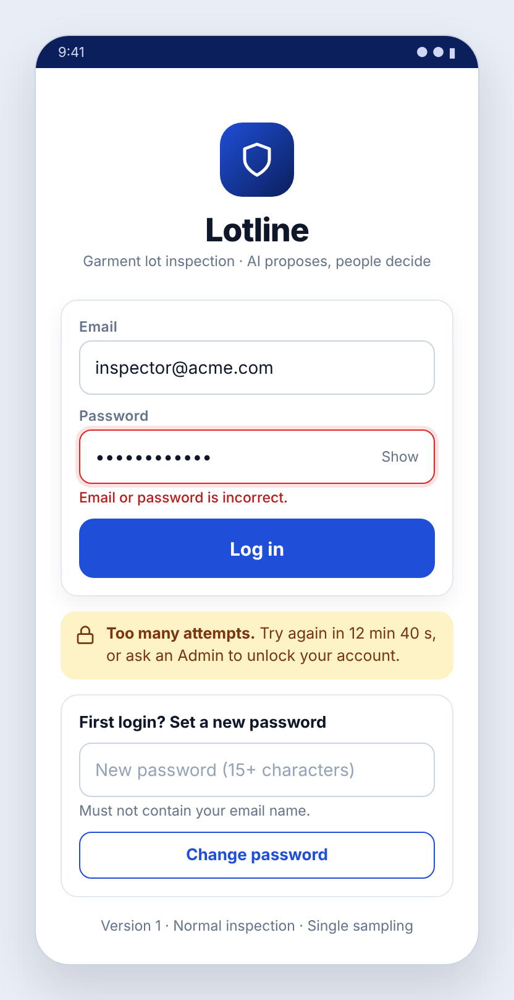

| Field | Value |
|---|---|
| Purpose | Sign in; all users |
| Primary user | Any user |
| Main components | Email field, password field, generic error area |
| Actions | Log in; change temporary password (first-login users only) |
| Validation / errors | Generic error for unknown email / wrong password / disabled account (identical body + status + timing, AUTH-03); lock message with remaining time after 5 failures in 15 min (AUTH-04); password-policy messages on change (15+ chars, no email local part, etc.) |
| Empty / loading | Spinner on submit; no empty state |
| Goes to | **Dashboard** on success. Stays on **Login** on failure. Temp-password users stay on a **Change password** view until changed. |

### Screen 2 — Dashboard

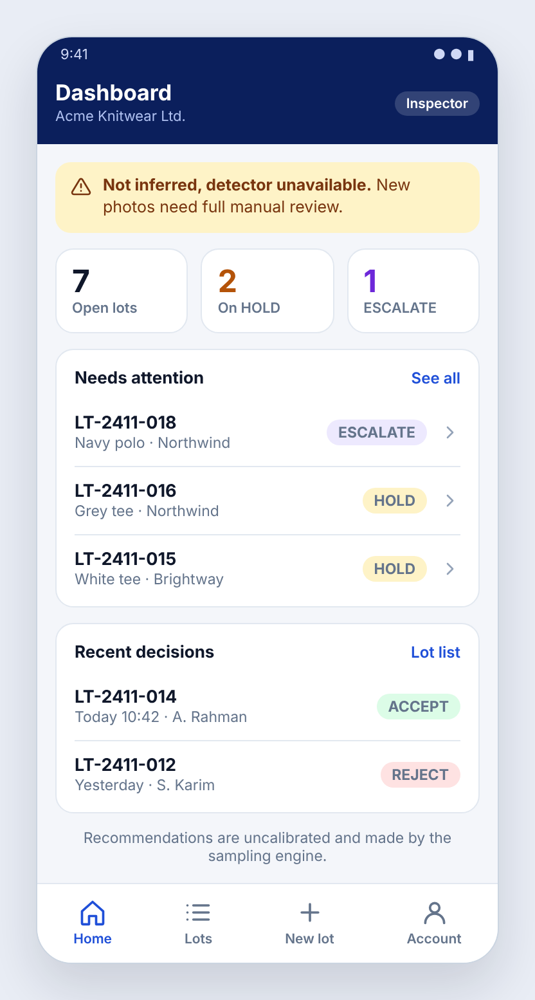

| Field | Value |
|---|---|
| Purpose | Overview; all roles (Admin sees alerts) |
| Primary user | All roles |
| Main components | Open lots, lots on HOLD/ESCALATE, recent decisions; **Admin:** alerts (inference down, low disk, backup failure, audit-chain mismatch, login-failure spike) |
| Actions | Open a lot; create a lot (Inspector, Supervisor) |
| Validation / errors | Alert banner "Not inferred, detector unavailable" when detector is down |
| Empty / loading | Skeleton; "No lots yet" with a create button |
| Goes to | **Lot list** (open lot) or **Create lot** (create). Admin alerts route to **Audit log** or **User management**. |

### Screen 3 — Lot list

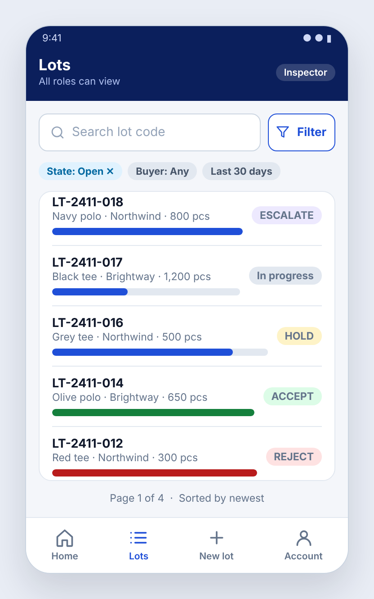

| Field | Value |
|---|---|
| Purpose | Find lots; all roles |
| Primary user | All roles |
| Main components | Filter (state, buyer, outcome, date), sort, pagination, outcome badge |
| Actions | Open; create (Inspector, Supervisor) |
| Validation / errors | Invalid filter value returns 422; hostile `sort` returns 422 (DB-01) |
| Empty / loading | "No lots match" |
| Goes to | **Lot details** (open) or **Create lot** (create) |

### Screen 4 — Create lot

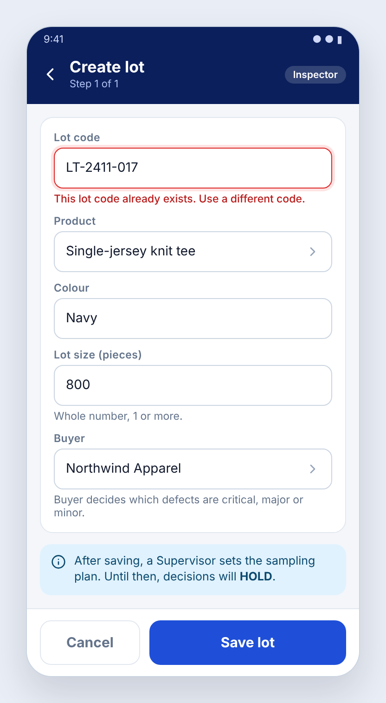

| Field | Value |
|---|---|
| Purpose | Register a lot; Inspector, Supervisor |
| Primary user | Inspector, Supervisor |
| Main components | Lot code, product, color, lot size, buyer |
| Actions | Save; cancel |
| Validation / errors | Duplicate code (UNIQUE `(organization, lot_code)`); lot size must be integer ≥ 1 (422); missing product or buyer → guidance to ask an Admin/Supervisor |
| Empty / loading | If product or buyer list is empty: message to ask an Admin or Supervisor |
| Goes to | **Lot details** on save; back to **Lot list** on cancel |

### Screen 5 — Lot details (control center)

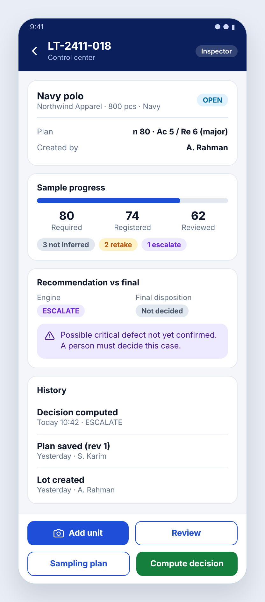

| Field | Value |
|---|---|
| Purpose | Control center for one lot; all roles |
| Primary user | All roles (Admin sees header + plan only, no images) |
| Main components | Header; plan summary with assumption label; sample progress (units registered / reviewed / required); status chips (not inferred, retake, escalate); current recommendation and final disposition; history timeline |
| Actions | Add unit; capture; review; compute; open plan; report |
| Validation / errors | Reason codes shown in words with the next step; 409 reload prompt on stale version |
| Empty / loading | "No units yet. Add the first garment." |
| Goes to | **Image capture** (add unit / capture), **Image review** (review), **Decision summary** (compute), **Sampling plan config** (open plan), **Report view** (report) |

### Screen 6 — Sampling plan configuration

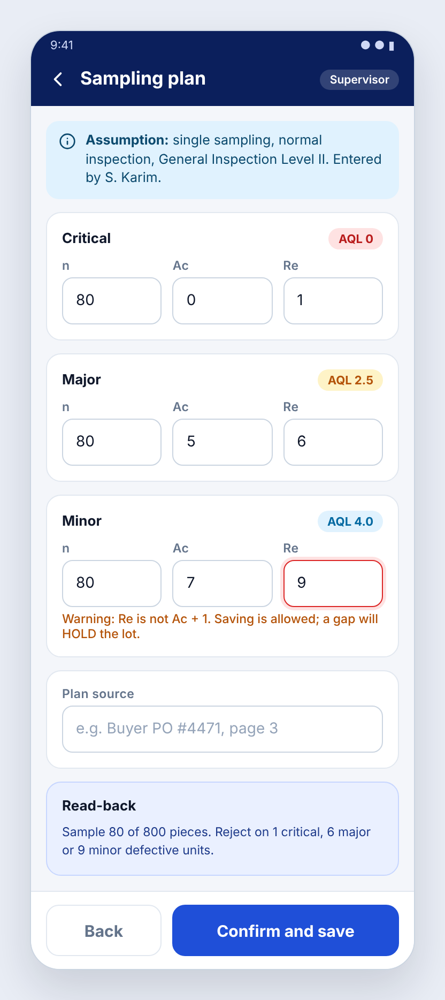

| Field | Value |
|---|---|
| Purpose | Enter `(n, Ac, Re)`; Supervisor |
| Primary user | Supervisor (writes); Inspector sees read-only |
| Main components | Assumption label; per-class fields (critical, major, minor); plan source text; warnings (`Re != Ac + 1`, `n` mismatch, `n >= lot size` means whole lot); read-back summary |
| Actions | Confirm and save |
| Validation / errors | Range errors (422); locked after a decision with explanation; Inspector sees read-only |
| Empty / loading | Not set: "Plan not set. Decisions will HOLD." |
| Goes to | Back to **Lot details**. New revision referenced by later decisions. |

### Screen 7 — Image capture and upload

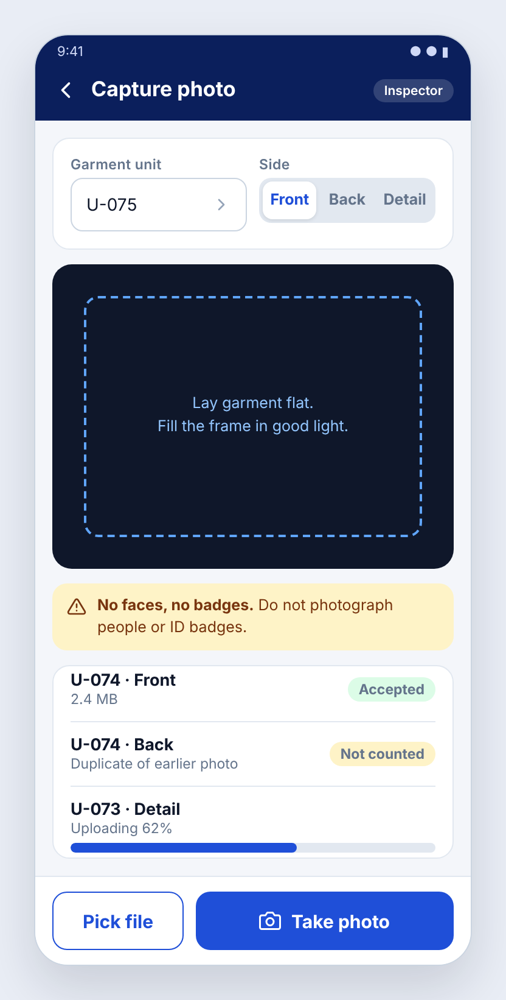

| Field | Value |
|---|---|
| Purpose | Photograph and upload; Inspector, Supervisor |
| Primary user | Inspector, Supervisor |
| Main components | Unit picker, side picker (front, back, detail), camera or file picker, guidance "no faces, no badges", per-file progress, result chips |
| Actions | Take or pick photo; retry; retake; withdraw |
| Validation / errors | Rejected with reason (type, size, unreadable); duplicate with link; rate-limit message (30/min/user); disk-full message |
| Empty / loading | Progress indicator; "No photos for this garment yet" |
| Goes to | Back to **Lot details**; a flagged image opens **Image capture** again for a retake |

### Screen 8 — Image review

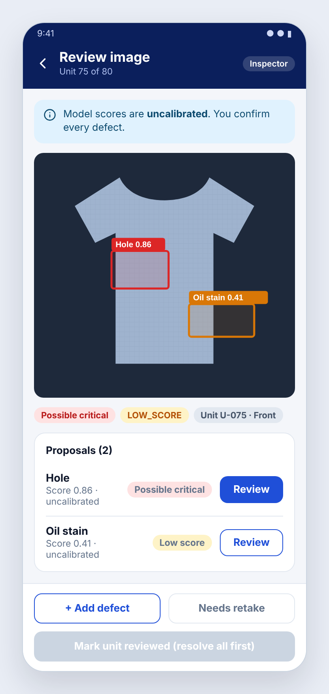

| Field | Value |
|---|---|
| Purpose | Review all proposals of an image; Inspector, Supervisor |
| Primary user | Inspector, Supervisor |
| Main components | Image with box overlay, zoom, proposal list with class, **uncalibrated** score, flags (BLUR, DARK, LOW_SCORE, UNKNOWN, possible critical), "not inferred" banner |
| Actions | Confirm, edit, reject each proposal; add defect; flag needs retake; next image |
| Validation / errors | Stale version 409; chain error; flagged image blocks marking reviewed |
| Empty / loading | Loading shimmer for predictions; "No proposals. This is not a pass. Review the photo." |
| Goes to | **Defect confirmation** (confirm/edit/add); back to **Lot details** when all units reviewed |

### Screen 9 — Defect confirmation

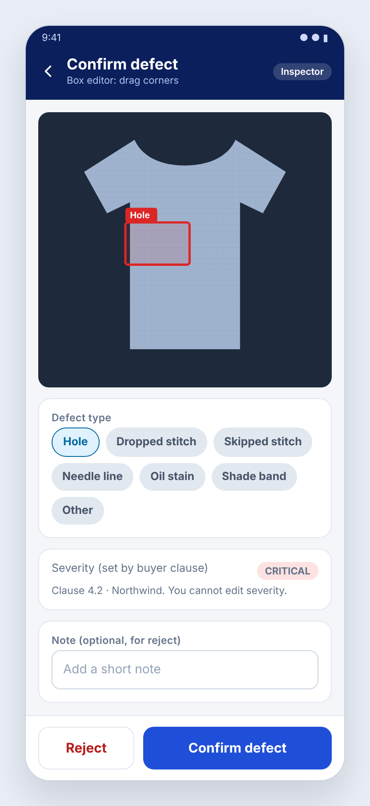

| Field | Value |
|---|---|
| Purpose | Confirm or edit one defect; Inspector, Supervisor |
| Primary user | Inspector, Supervisor |
| Main components | Type list (hole, dropped stitch, skipped stitch, needle line, oil stain, shade band, other), box editor, server-assigned severity or "no clause: escalate" |
| Actions | Confirm; edit; reject with optional note; mark unit reviewed ("Reviewed, no defect" has its own confirm) |
| Validation / errors | Type outside list rejected; severity never editable (server sets it from the clause list, AZ-06) |
| Empty / loading | Saving indicator; clear failure message |
| Goes to | Back to **Image review**; once all units reviewed, the user proceeds to **Decision summary** |

### Screen 10 — Decision summary

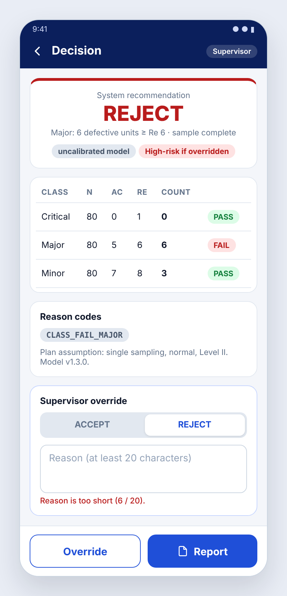

| Field | Value |
|---|---|
| Purpose | See recommendation; Inspector, Supervisor; others read |
| Primary user | Inspector, Supervisor |
| Main components | Outcome; per class `n`, `Ac`, `Re`, count, PASS/FAIL/GAP; reason codes; plan assumption; **uncalibrated** label; model versions; override panel (Supervisor); high-risk badge |
| Actions | Compute; override; generate report |
| Validation / errors | 503 "Nothing was saved"; override reason too short (< 20 chars) |
| Empty / loading | "No decision yet. Compute decision." |
| Goes to | **Report view** (generate report); stays on screen for Supervisor override |

### Screen 11 — Report view

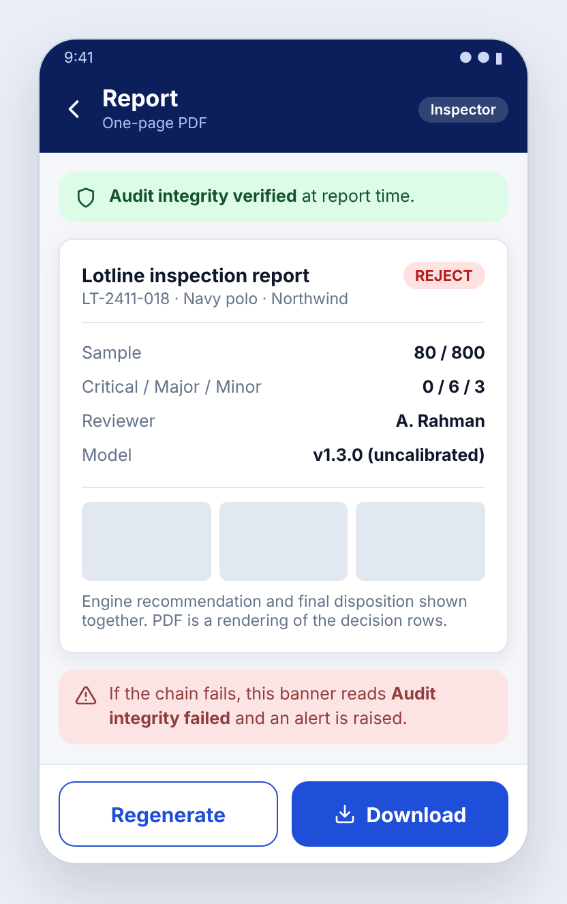

| Field | Value |
|---|---|
| Purpose | View and download the one-page PDF; all roles |
| Primary user | All roles (generate: Inspector own lot, Supervisor) |
| Main components | PDF preview, download button, integrity banner |
| Actions | Generate (Inspector own, Supervisor); download |
| Validation / errors | "Audit integrity failed" banner; foreign lot returns 404 |
| Empty / loading | "Generating"; "No report yet" |
| Goes to | Stays on screen; download is a side-effect |

### Screen 12 — User management

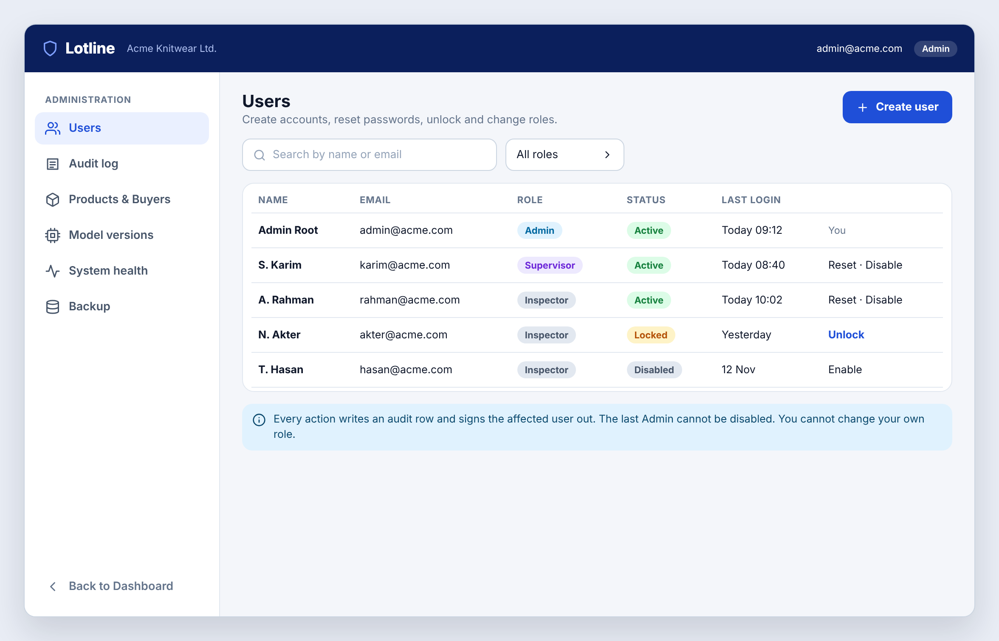

| Field | Value |
|---|---|
| Purpose | Accounts; Admin |
| Primary user | Admin |
| Main components | User table, role, status; create; reset; unlock; disable |
| Actions | Create; disable or enable; change role; reset password; unlock |
| Validation / errors | Last Admin protected; own-role change blocked; password policy enforced |
| Empty / loading | "No users" cannot occur; loading skeleton |
| Goes to | Back to **Dashboard**; affected user's sessions are revoked |

### Screen 13 — Audit log

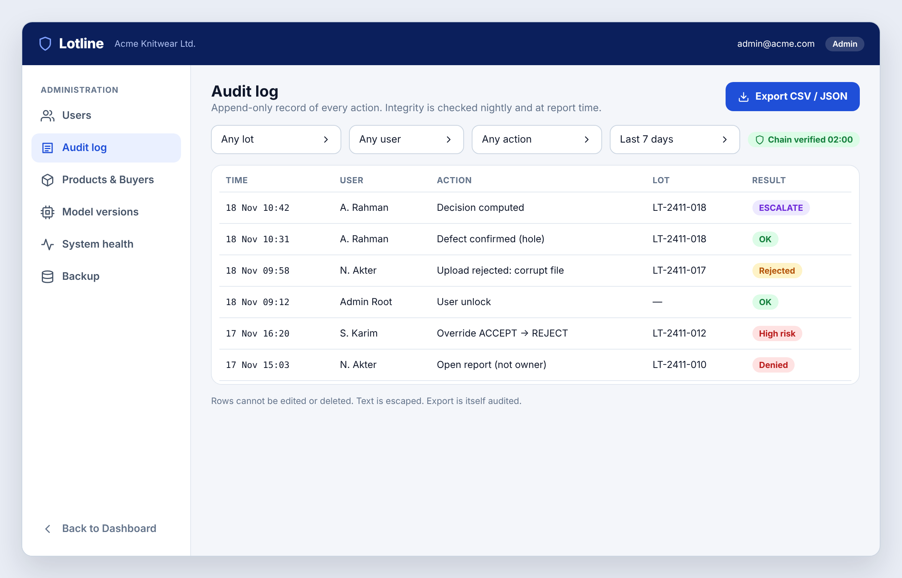

| Field | Value |
|---|---|
| Purpose | Review events; Supervisor, Admin (export: Admin) |
| Primary user | Supervisor, Admin |
| Main components | Filter by lot, user, action, date; before/after view; integrity status |
| Actions | Filter; export (Admin) |
| Validation / errors | Escaped text (AUD-10); export is itself audited; denied rows visible |
| Empty / loading | "No events match" |
| Goes to | Stays on screen; export downloads a file |

### Screen 14 — Admin Panel (tabbed hub)

**Mockups (Users and Audit tabs are screens 12 and 13 above):**

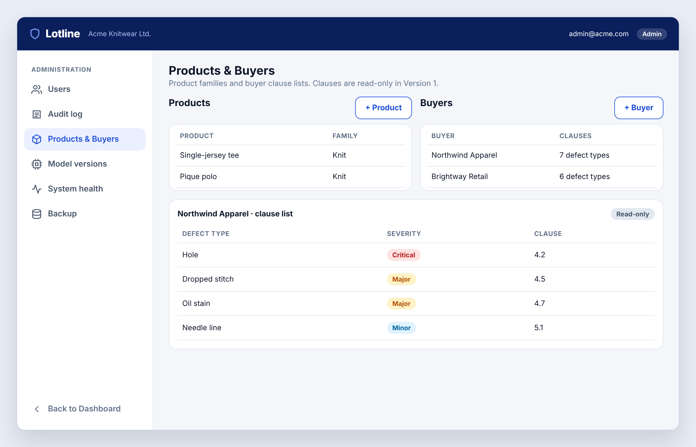

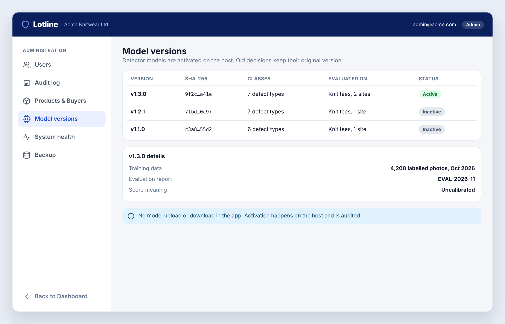

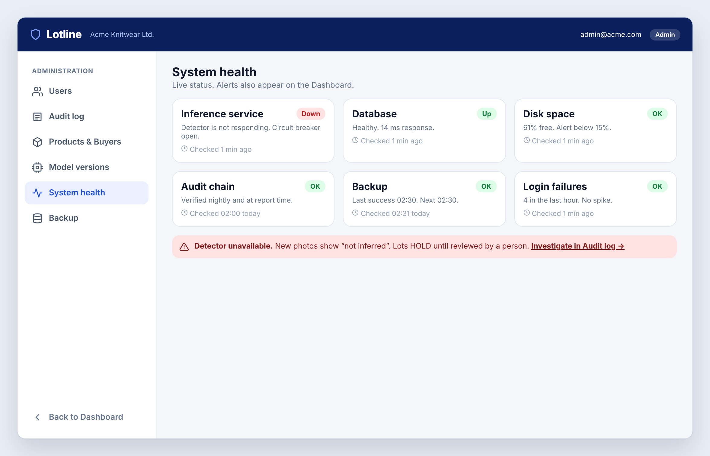

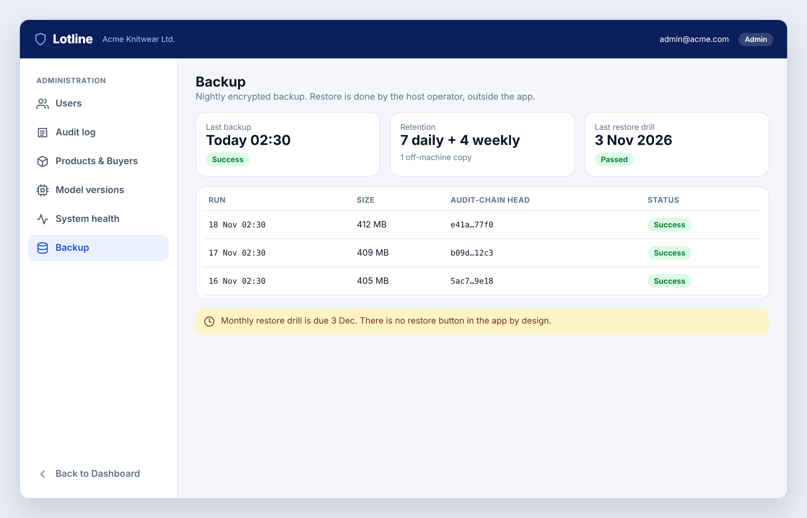

The Admin Panel consolidates the previously separate **User management** (Screen 12) and **Audit log** (Screen 13) screens, and adds tabs the PRD scattered across the Dashboard and the host. The panel is reached from the Dashboard's "Admin" entry (Admin only) or its own deep link. Supervisor sees **only the Audit tab**, read-only, without the Export button (AZ-02, AUD-08). Admin never sees garment images from anywhere in the panel (CG-04).

| Field | Value |
|---|---|
| Purpose | One place for all system administration; Admin (Supervisor: Audit tab only) |
| Primary user | Admin |
| Main components | Left rail with six tabs; top bar with org name, logged-in user, role badge; a per-tab work area. The active tab is persisted in the URL so a refresh keeps context. |
| Tab 1 — Users | User table (email, display name, role, status, last login); create user; reset password; unlock account; disable / re-enable; change role. Same rules as old Screen 12: last Admin protected, own-role change blocked, password policy enforced, every action writes an audit row and revokes the affected user's sessions. |
| Tab 2 — Audit log | Same as old Screen 13: filter by lot / user / action / date, before/after view, integrity status. **Supervisor lands here**, sees no Export button. Admin sees Export (audited). |
| Tab 3 — Products & Buyers | Product records (one knit family in Version 1, OQ-06) and buyer records; each buyer carries a clause list (FR-CLS-001). Create and edit; clause list is read-only in Version 1 (Supervisor editing is Version 2, CG-03). Every change writes an audit row. |
| Tab 4 — Model versions | List of model versions with artifact SHA-256, trained class list, training data description, evaluation domains, evaluation report reference, and activation status. Admin activates a version (on the host in Version 1, FR-VIS-012); activation is audited. Old predictions and decisions keep their original model version. No model upload or download endpoint (AI-03). |
| Tab 5 — System health | Live status cards: inference service (up / down / circuit breaker open), database, disk free space, audit-chain integrity (last nightly check + last report-time check), backup (last success, last failure, next scheduled), login-failure spike. Each card shows a one-line plain-language status and the time of last check. Raised alerts also surface on the Dashboard banner (FR-OPS-001, DEP-10). |
| Tab 6 — Backup | Status of nightly backup (last run, status, manifest with audit-chain head, retention: 7 daily + 4 weekly, one off-machine copy, encrypted). Restore is a host-operator action outside the web app (FR-OPS-003) — this tab shows the last restore-drill result and reminds the operator of the monthly cadence. Admin has no restore button in the app. |
| Validation / errors | Every state-changing action requires a CSRF token (AUTH-09); denied attempts return 403 + a denied audit row (AZ-13); stale version on a row returns 409 with a reload prompt (AZ-11). Generic error bodies with a request ID, no stack trace (NFR-USA-003). |
| Empty / loading | Users tab: never empty (skeleton). Audit tab: "No events match". Products & Buyers: "No products yet" / "No buyers yet" with a create button. Models: "No model versions. Add one on the host." Health: skeleton while probing. Backup: "No backup has run yet." |
| Goes to | Tabs switch in place. Users tab → self (after create / reset / unlock). Audit tab → self (export downloads a file). Products & Buyers → self. Models → self (activation is audited). Health → Audit tab (to investigate an alert). Backup → self. A "Back to Dashboard" link returns to **Dashboard**. |

#### Admin Panel navigation flow

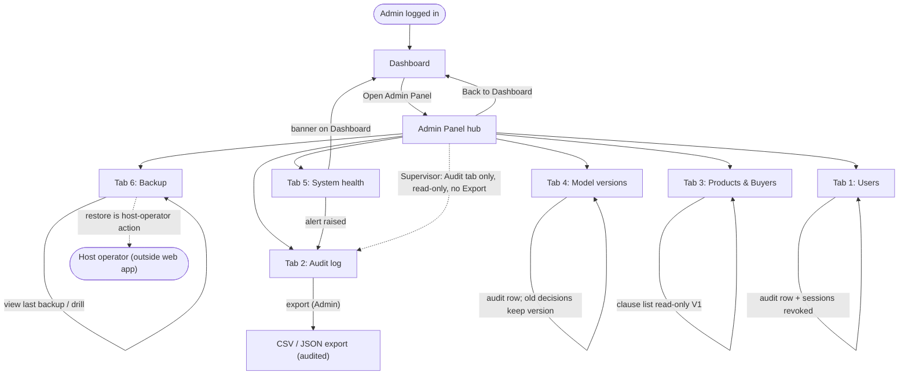
```mermaid
flowchart TD
  A([Admin logged in]) --> B["Dashboard"]
  B -->|"Open Admin Panel"| AP["Admin Panel hub"]
  AP --> T1["Tab 1: Users"]
  AP --> T2["Tab 2: Audit log"]
  AP --> T3["Tab 3: Products & Buyers"]
  AP --> T4["Tab 4: Model versions"]
  AP --> T5["Tab 5: System health"]
  AP --> T6["Tab 6: Backup"]
  T1 -->|create / reset / unlock / disable / role| T1
  T1 -->|audit row + sessions revoked| T1
  T2 -->|"export (Admin)"| DL["CSV / JSON export (audited)"]
  T3 -->|create / edit product or buyer| T3
  T3 -->|clause list read-only V1| T3
  T4 -->|"activate version (on host)"| T4
  T4 -->|audit row; old decisions keep version| T4
  T5 -->|alert raised| T2
  T5 -->|banner on Dashboard| B
  T6 -->|view last backup / drill| T6
  T6 -.->|restore is host-operator action| HOST(["Host operator (outside web app)"])
  AP -->|"Back to Dashboard"| B
  AP -.->|"Supervisor: Audit tab only, read-only, no Export"| T2
```

#### Admin Panel permission map (what each role sees per tab)

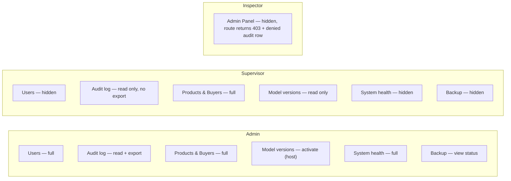
```mermaid
flowchart LR
  subgraph Adm["Admin"]
    A1["Users — full"]
    A2["Audit log — read + export"]
    A3["Products & Buyers — full"]
    A4["Model versions — activate (host)"]
    A5["System health — full"]
    A6["Backup — view status"]
  end
  subgraph Sup["Supervisor"]
    S1["Users — hidden"]
    S2["Audit log — read only, no export"]
    S3["Products & Buyers — full"]
    S4["Model versions — read only"]
    S5["System health — hidden"]
    S6["Backup — hidden"]
  end
  subgraph Oth["Inspector"]
    O1["Admin Panel — hidden, route returns 403 + denied audit row"]
  end
```

---

## 5. End-to-end user flows (W-01 to W-16)

### W-01 Admin creates an inspector account

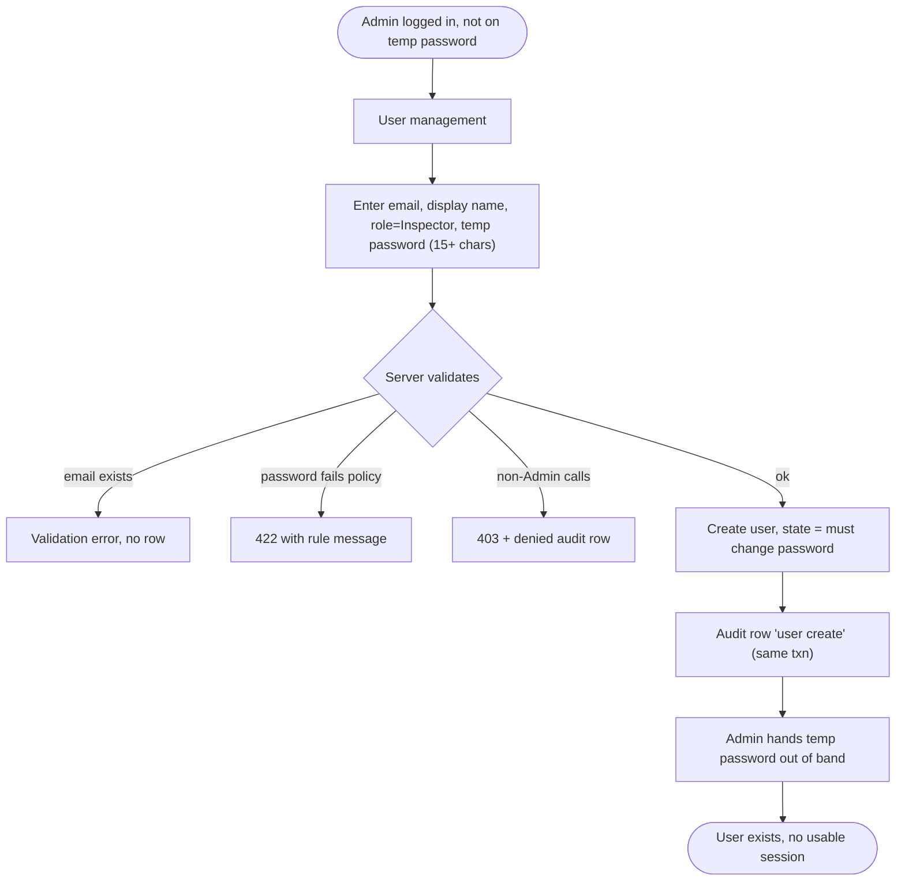
```mermaid
flowchart TD
  A([Admin logged in, not on temp password]) --> B["User management"]
  B --> C["Enter email, display name, role=Inspector, temp password (15+ chars)"]
  C --> D{"Server validates"}
  D -->|"email exists"| E["Validation error, no row"]
  D -->|"password fails policy"| F["422 with rule message"]
  D -->|"non-Admin calls"| G["403 + denied audit row"]
  D -->|"ok"| H["Create user, state = must change password"]
  H --> I["Audit row 'user create' (same txn)"]
  I --> J["Admin hands temp password out of band"]
  J --> K([User exists, no usable session])
```

### W-02 User logs in and logs out

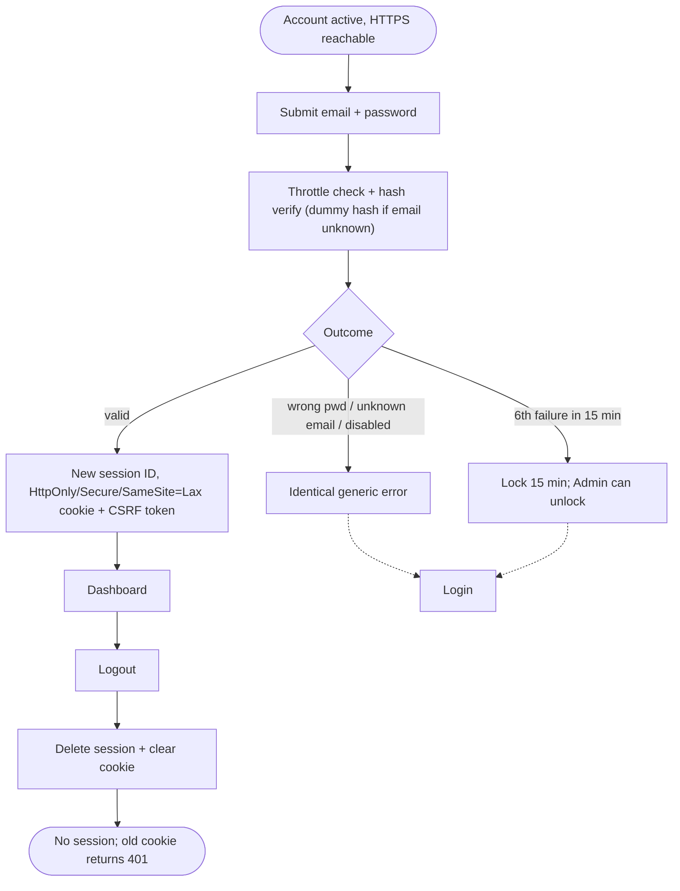
```mermaid
flowchart TD
  A([Account active, HTTPS reachable]) --> B["Submit email + password"]
  B --> C["Throttle check + hash verify (dummy hash if email unknown)"]
  C --> D{"Outcome"}
  D -->|"valid"| E["New session ID, HttpOnly/Secure/SameSite=Lax cookie + CSRF token"]
  D -->|"wrong pwd / unknown email / disabled"| F["Identical generic error"]
  D -->|"6th failure in 15 min"| G["Lock 15 min; Admin can unlock"]
  E --> H["Dashboard"]
  H --> I["Logout"]
  I --> J["Delete session + clear cookie"]
  J --> K([No session; old cookie returns 401])
  F -.-> L["Login"]
  G -.-> L
```

### W-03 Inspector creates a lot

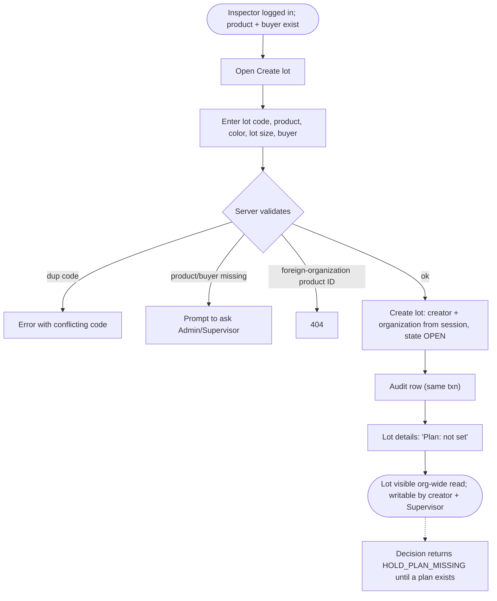
```mermaid
flowchart TD
  A([Inspector logged in; product + buyer exist]) --> B["Open Create lot"]
  B --> C["Enter lot code, product, color, lot size, buyer"]
  C --> D{"Server validates"}
  D -->|"dup code"| E["Error with conflicting code"]
  D -->|"product/buyer missing"| F["Prompt to ask Admin/Supervisor"]
  D -->|"foreign-organization product ID"| G["404"]
  D -->|"ok"| H["Create lot: creator + organization from session, state OPEN"]
  H --> I["Audit row (same txn)"]
  I --> J["Lot details: 'Plan: not set'"]
  J --> K([Lot visible org-wide read; writable by creator + Supervisor])
  K -.-> L["Decision returns HOLD_PLAN_MISSING until a plan exists"]
```

### W-04 Supervisor configures a sampling plan

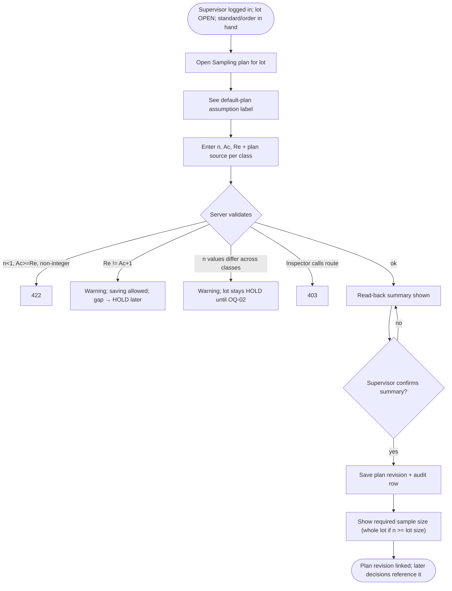
```mermaid
flowchart TD
  A([Supervisor logged in; lot OPEN; standard/order in hand]) --> B["Open Sampling plan for lot"]
  B --> C["See default-plan assumption label"]
  C --> D["Enter n, Ac, Re + plan source per class"]
  D --> E{"Server validates"}
  E -->|"n<1, Ac>=Re, non-integer"| F["422"]
  E -->|"Re != Ac+1"| G["Warning; saving allowed; gap → HOLD later"]
  E -->|"n values differ across classes"| H["Warning; lot stays HOLD until OQ-02"]
  E -->|"Inspector calls route"| I["403"]
  E -->|"ok"| J["Read-back summary shown"]
  J --> K{"Supervisor confirms summary?"}
  K -->|"no"| J
  K -->|"yes"| L["Save plan revision + audit row"]
  L --> M["Show required sample size (whole lot if n >= lot size)"]
  M --> N([Plan revision linked; later decisions reference it])
```

### W-05 Inspector captures and uploads garment photos

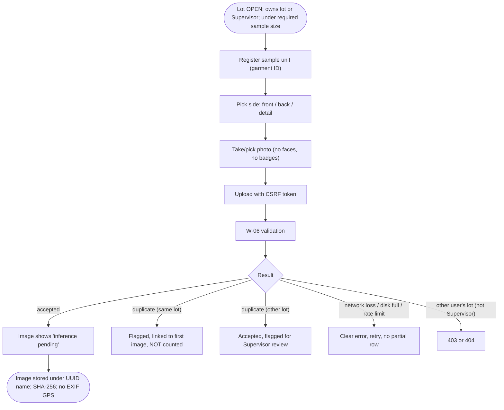
```mermaid
flowchart TD
  A([Lot OPEN; owns lot or Supervisor; under required sample size]) --> B["Register sample unit (garment ID)"]
  B --> C["Pick side: front / back / detail"]
  C --> D["Take/pick photo (no faces, no badges)"]
  D --> E["Upload with CSRF token"]
  E --> F["W-06 validation"]
  F --> G{"Result"}
  G -->|"accepted"| H["Image shows 'inference pending'"]
  G -->|"duplicate (same lot)"| I["Flagged, linked to first image, NOT counted"]
  G -->|"duplicate (other lot)"| J["Accepted, flagged for Supervisor review"]
  G -->|"network loss / disk full / rate limit"| K["Clear error, retry, no partial row"]
  G -->|"other user's lot (not Supervisor)"| L["403 or 404"]
  H --> M([Image stored under UUID name; SHA-256; no EXIF GPS])
```

### W-06 System validates uploaded images

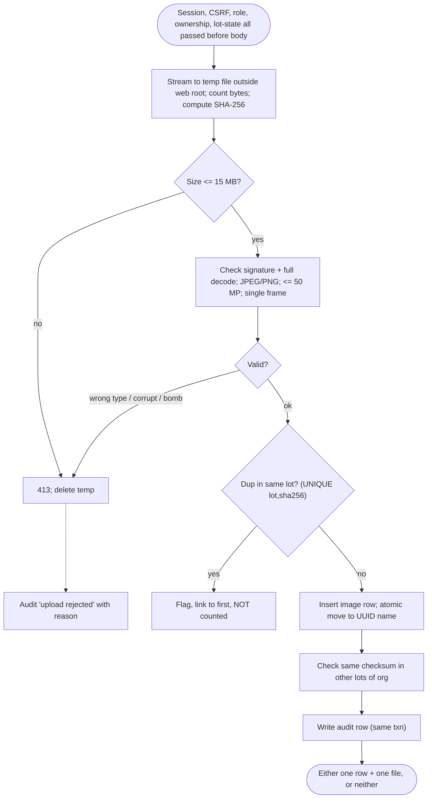
```mermaid
flowchart TD
  A([Session, CSRF, role, ownership, lot-state all passed before body]) --> B["Stream to temp file outside web root; count bytes; compute SHA-256"]
  B --> C{"Size <= 15 MB?"}
  C -->|"no"| E1["413; delete temp"]
  C -->|"yes"| D["Check signature + full decode; JPEG/PNG; <= 50 MP; single frame"]
  D --> E{"Valid?"}
  E -->|"wrong type / corrupt / bomb"| E1
  E -->|"ok"| F{"Dup in same lot? (UNIQUE lot,sha256)"}
  F -->|"yes"| G["Flag, link to first, NOT counted"]
  F -->|"no"| H["Insert image row; atomic move to UUID name"]
  H --> I["Check same checksum in other lots of org"]
  I --> J["Write audit row (same txn)"]
  J --> K([Either one row + one file, or neither])
  E1 -.-> L["Audit 'upload rejected' with reason"]
```

### W-07 System runs defect inference

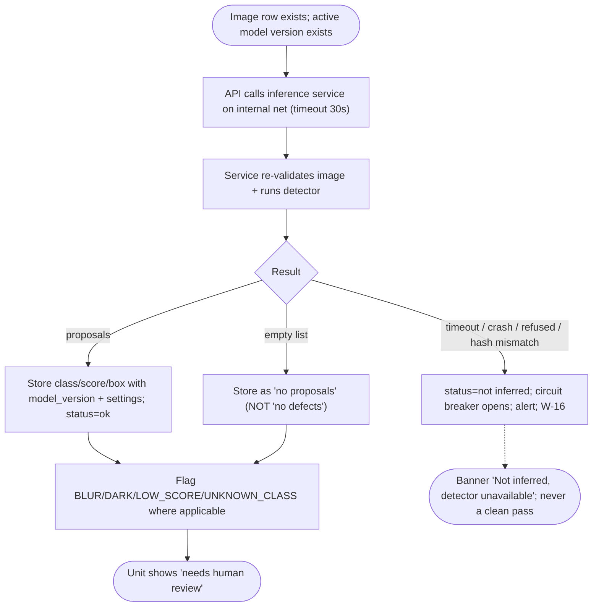
```mermaid
flowchart TD
  A([Image row exists; active model version exists]) --> B["API calls inference service on internal net (timeout 30s)"]
  B --> C["Service re-validates image + runs detector"]
  C --> D{"Result"}
  D -->|"proposals"| E["Store class/score/box with model_version + settings; status=ok"]
  D -->|"empty list"| F["Store as 'no proposals' (NOT 'no defects')"]
  D -->|"timeout / crash / refused / hash mismatch"| G["status=not inferred; circuit breaker opens; alert; W-16"]
  E --> H["Flag BLUR/DARK/LOW_SCORE/UNKNOWN_CLASS where applicable"]
  F --> H
  H --> I([Unit shows 'needs human review'])
  G -.-> J([Banner 'Not inferred, detector unavailable'; never a clean pass])
```

### W-08 Inspector reviews predictions

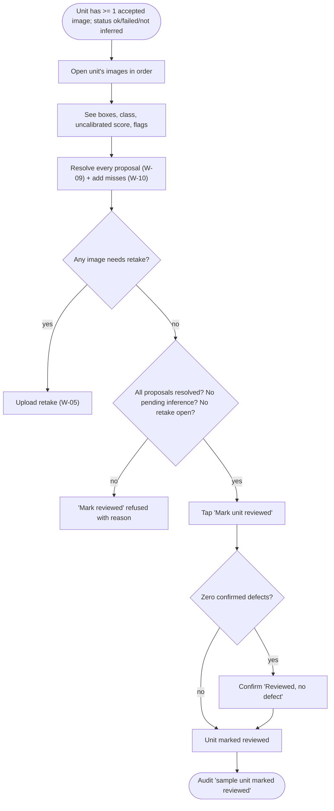
```mermaid
flowchart TD
  A([Unit has >= 1 accepted image; status ok/failed/not inferred]) --> B["Open unit's images in order"]
  B --> C["See boxes, class, uncalibrated score, flags"]
  C --> D["Resolve every proposal (W-09) + add misses (W-10)"]
  D --> E{"Any image needs retake?"}
  E -->|"yes"| F["Upload retake (W-05)"]
  E -->|"no"| G{"All proposals resolved? No pending inference? No retake open?"}
  G -->|"no"| H["'Mark reviewed' refused with reason"]
  G -->|"yes"| I["Tap 'Mark unit reviewed'"]
  I --> J{"Zero confirmed defects?"}
  J -->|"yes"| K["Confirm 'Reviewed, no defect'"]
  J -->|"no"| L["Unit marked reviewed"]
  K --> L
  L --> M([Audit 'sample unit marked reviewed'])
```

### W-09 Inspector confirms or rejects a defect

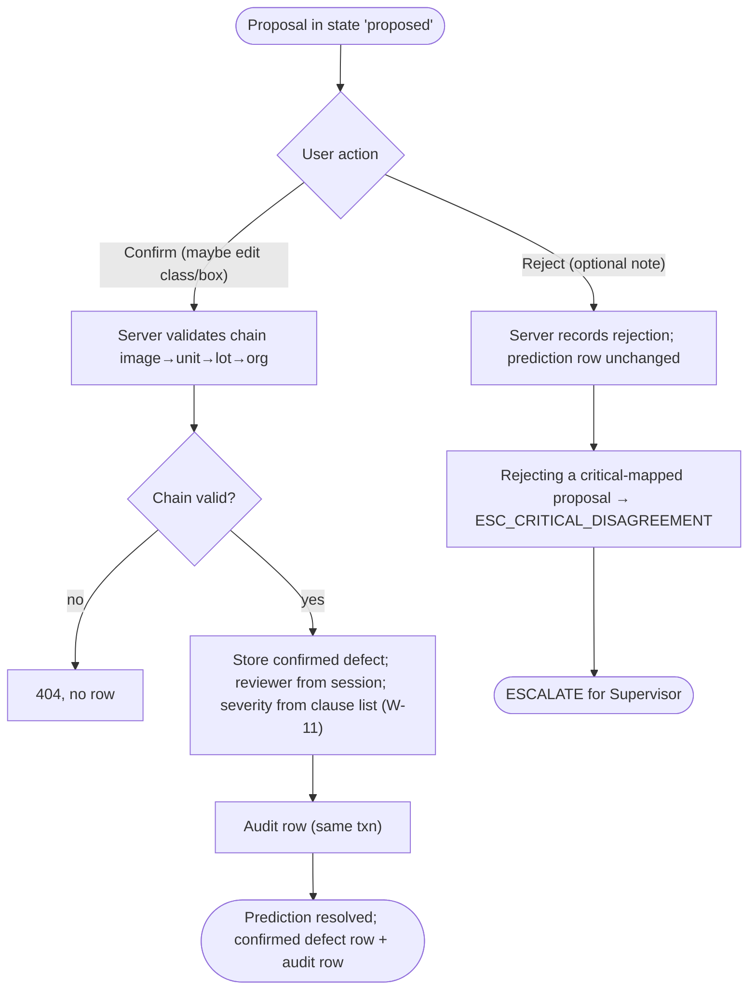
```mermaid
flowchart TD
  A([Proposal in state 'proposed']) --> B{"User action"}
  B -->|"Confirm (maybe edit class/box)"| C["Server validates chain image→unit→lot→org"]
  B -->|"Reject (optional note)"| D["Server records rejection; prediction row unchanged"]
  C --> E{"Chain valid?"}
  E -->|"no"| F["404, no row"]
  E -->|"yes"| G["Store confirmed defect; reviewer from session; severity from clause list (W-11)"]
  G --> H["Audit row (same txn)"]
  H --> I([Prediction resolved; confirmed defect row + audit row])
  D --> J["Rejecting a critical-mapped proposal → ESC_CRITICAL_DISAGREEMENT"]
  J --> K([ESCALATE for Supervisor])
```

### W-10 Inspector manually adds a missed defect

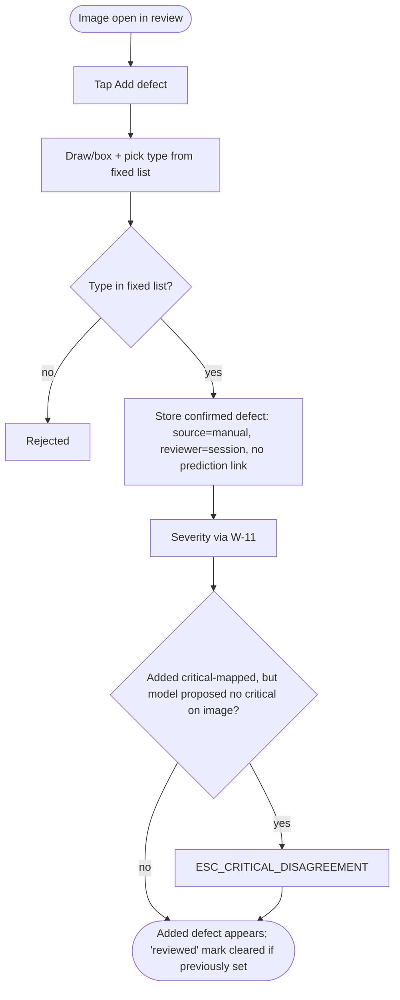
```mermaid
flowchart TD
  A([Image open in review]) --> B["Tap Add defect"]
  B --> C["Draw/box + pick type from fixed list"]
  C --> D{"Type in fixed list?"}
  D -->|"no"| E["Rejected"]
  D -->|"yes"| F["Store confirmed defect: source=manual, reviewer=session, no prediction link"]
  F --> G["Severity via W-11"]
  G --> H{"Added critical-mapped, but model proposed no critical on image?"}
  H -->|"yes"| I["ESC_CRITICAL_DISAGREEMENT"]
  H -->|"no"| J([Added defect appears; 'reviewed' mark cleared if previously set])
  I --> J
```

### W-11 System assigns severity using buyer clauses

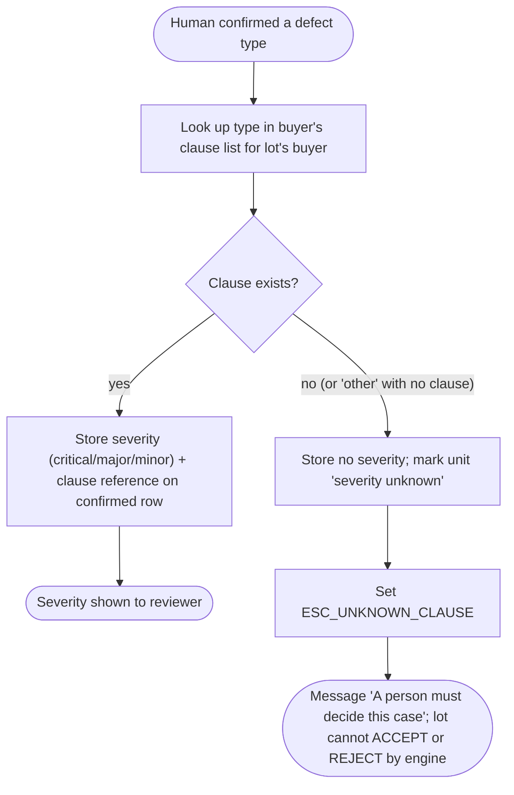
```mermaid
flowchart TD
  A([Human confirmed a defect type]) --> B["Look up type in buyer's clause list for lot's buyer"]
  B --> C{"Clause exists?"}
  C -->|"yes"| D["Store severity (critical/major/minor) + clause reference on confirmed row"]
  C -->|"no (or 'other' with no clause)"| E["Store no severity; mark unit 'severity unknown'"]
  D --> F([Severity shown to reviewer])
  E --> G["Set ESC_UNKNOWN_CLAUSE"]
  G --> H([Message 'A person must decide this case'; lot cannot ACCEPT or REJECT by engine])
```

### W-12 System calculates defective-unit counts

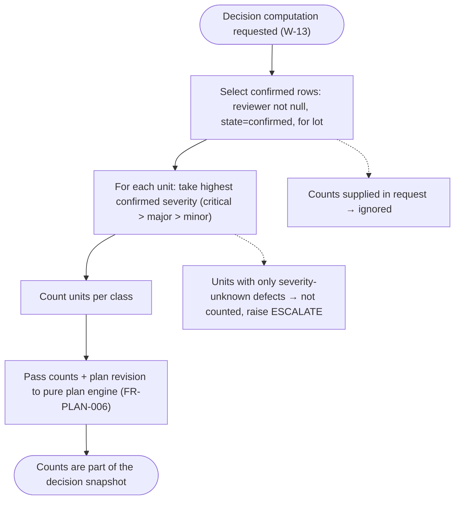
```mermaid
flowchart TD
  A(["Decision computation requested (W-13)"]) --> B["Select confirmed rows: reviewer not null, state=confirmed, for lot"]
  B --> C["For each unit: take highest confirmed severity (critical > major > minor)"]
  C --> D["Count units per class"]
  D --> E["Pass counts + plan revision to pure plan engine (FR-PLAN-006)"]
  E --> F([Counts are part of the decision snapshot])
  C -.-> G["Units with only severity-unknown defects → not counted, raise ESCALATE"]
  B -.-> H["Counts supplied in request → ignored"]
```

### W-13 System generates a lot decision

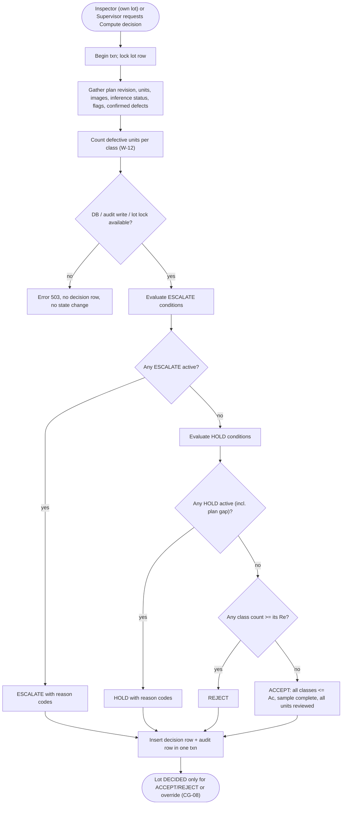
```mermaid
flowchart TD
  A(["Inspector (own lot) or Supervisor requests Compute decision"]) --> B["Begin txn; lock lot row"]
  B --> C["Gather plan revision, units, images, inference status, flags, confirmed defects"]
  C --> D["Count defective units per class (W-12)"]
  D --> E{"DB / audit write / lot lock available?"}
  E -->|"no"| X["Error 503, no decision row, no state change"]
  E -->|"yes"| F["Evaluate ESCALATE conditions"]
  F --> G{"Any ESCALATE active?"}
  G -->|"yes"| ESC["ESCALATE with reason codes"]
  G -->|"no"| H["Evaluate HOLD conditions"]
  H --> I{"Any HOLD active (incl. plan gap)?"}
  I -->|"yes"| HOLD["HOLD with reason codes"]
  I -->|"no"| J{"Any class count >= its Re?"}
  J -->|"yes"| REJ["REJECT"]
  J -->|"no"| ACC["ACCEPT: all classes <= Ac, sample complete, all units reviewed"]
  ESC --> Z["Insert decision row + audit row in one txn"]
  HOLD --> Z
  REJ --> Z
  ACC --> Z
  Z --> K(["Lot DECIDED only for ACCEPT/REJECT or override (CG-08)"])
```

### W-14 Supervisor overrides a recommendation

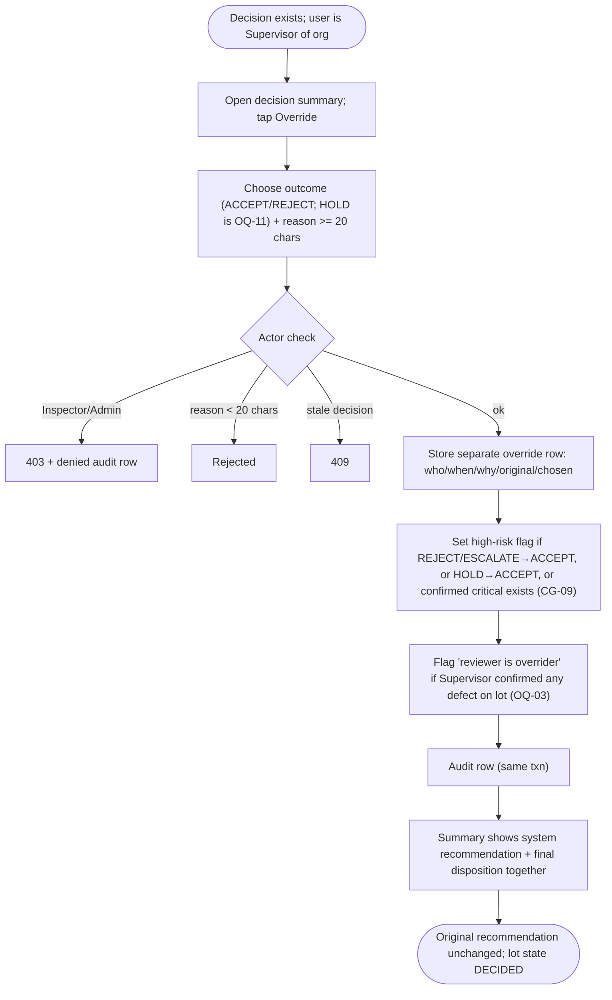
```mermaid
flowchart TD
  A([Decision exists; user is Supervisor of org]) --> B["Open decision summary; tap Override"]
  B --> C["Choose outcome (ACCEPT/REJECT; HOLD is OQ-11) + reason >= 20 chars"]
  C --> D{"Actor check"}
  D -->|"Inspector/Admin"| E["403 + denied audit row"]
  D -->|"reason < 20 chars"| F["Rejected"]
  D -->|"stale decision"| G["409"]
  D -->|"ok"| H["Store separate override row: who/when/why/original/chosen"]
  H --> I["Set high-risk flag if REJECT/ESCALATE→ACCEPT, or HOLD→ACCEPT, or confirmed critical exists (CG-09)"]
  I --> J["Flag 'reviewer is overrider' if Supervisor confirmed any defect on lot (OQ-03)"]
  J --> K["Audit row (same txn)"]
  K --> L["Summary shows system recommendation + final disposition together"]
  L --> M([Original recommendation unchanged; lot state DECIDED])
```

### W-15 User generates and views a PDF report

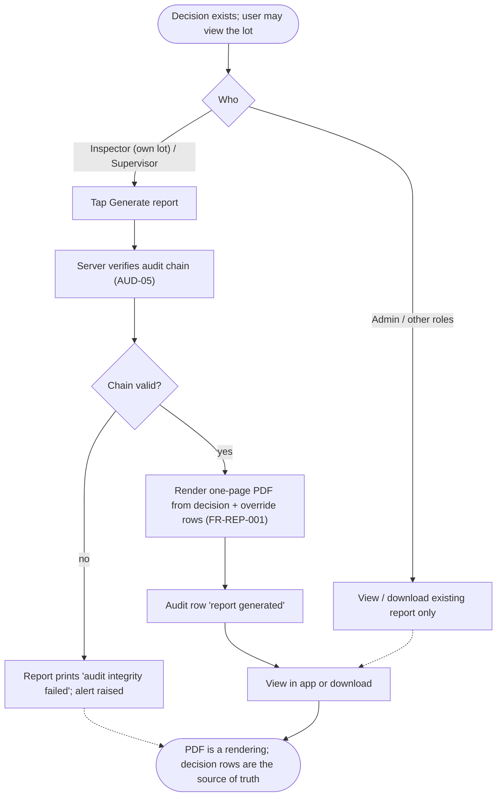
```mermaid
flowchart TD
  A([Decision exists; user may view the lot]) --> B{"Who"}
  B -->|"Inspector (own lot) / Supervisor"| C["Tap Generate report"]
  B -->|"Admin / other roles"| D["View / download existing report only"]
  C --> E["Server verifies audit chain (AUD-05)"]
  E --> F{"Chain valid?"}
  F -->|"no"| G["Report prints 'audit integrity failed'; alert raised"]
  F -->|"yes"| H["Render one-page PDF from decision + override rows (FR-REP-001)"]
  H --> I["Audit row 'report generated'"]
  I --> J["View in app or download"]
  J --> K([PDF is a rendering; decision rows are the source of truth])
  G -.-> K
  D -.-> J
```

### W-16 Inspector continues manual inspection when inference is unavailable

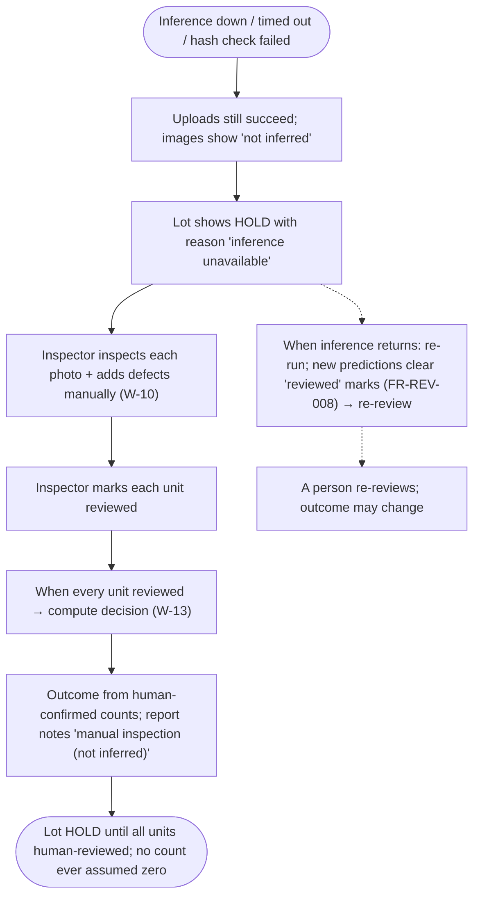
```mermaid
flowchart TD
  A([Inference down / timed out / hash check failed]) --> B["Uploads still succeed; images show 'not inferred'"]
  B --> C["Lot shows HOLD with reason 'inference unavailable'"]
  C --> D["Inspector inspects each photo + adds defects manually (W-10)"]
  D --> E["Inspector marks each unit reviewed"]
  E --> F["When every unit reviewed → compute decision (W-13)"]
  F --> G["Outcome from human-confirmed counts; report notes 'manual inspection (not inferred)'"]
  G --> H([Lot HOLD until all units human-reviewed; no count ever assumed zero])
  C -.-> I["When inference returns: re-run; new predictions clear 'reviewed' marks (FR-REV-008) → re-review"]
  I -.-> J["A person re-reviews; outcome may change"]
```

---

## 6. Decision and failure flows

### 6.1 Decision engine — precedence (PRD 9.7)

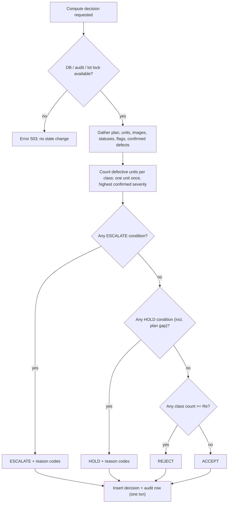
```mermaid
flowchart TD
  A["Compute decision requested"] --> B{"DB / audit / lot lock available?"}
  B -->|"no"| X["Error 503; no state change"]
  B -->|"yes"| C["Gather plan, units, images, statuses, flags, confirmed defects"]
  C --> D["Count defective units per class: one unit once, highest confirmed severity"]
  D --> E{"Any ESCALATE condition?"}
  E -->|"yes"| ESC["ESCALATE + reason codes"]
  E -->|"no"| F{"Any HOLD condition (incl. plan gap)?"}
  F -->|"yes"| HOLD["HOLD + reason codes"]
  F -->|"no"| G{"Any class count >= Re?"}
  G -->|"yes"| REJ["REJECT"]
  G -->|"no"| ACC["ACCEPT"]
  ESC --> Z["Insert decision + audit row (one txn)"]
  HOLD --> Z
  REJ --> Z
  ACC --> Z
```

**Precedence:** ESCALATE over HOLD over ACCEPT/REJECT (BR-18). All active reason codes and provisional class results are stored. HOLD and ESCALATE are **Lotline workflow states**, not ISO 2859-1 outcomes (BR-20).

### 6.2 Outcome + reason code quick map

```mermaid
flowchart LR
  subgraph ESC["ESCALATE — a person must decide"]
    E1["ESC_POSSIBLE_CRITICAL_UNCONFIRMED"]
    E2["ESC_CLASS_OUTSIDE_LIST"]
    E3["ESC_UNKNOWN_CLAUSE"]
    E4["ESC_CRITICAL_DISAGREEMENT"]
  end
  subgraph HD["HOLD — sampling rule cannot be applied yet"]
    H1["HOLD_PLAN_MISSING"]
    H2["HOLD_SAMPLE_INCOMPLETE"]
    H3["HOLD_UNIT_NOT_REVIEWED"]
    H4["HOLD_RETAKE_REQUIRED"]
    H5["HOLD_IMAGE_FILE_PROBLEM"]
    H6["HOLD_PLAN_GAP"]
    H7["HOLD_PLAN_N_MISMATCH"]
    H8["HOLD_CALIBRATED_INTERVAL (inactive V1)"]
  end
  ACC["ACCEPT — all classes PASS, sample complete, all reviewed"]
  REJ["REJECT — any class FAIL, sample complete, all reviewed"]
  ESC -.precedence over.-> HD
  HD -.precedence over.-> ACC
  HD -.precedence over.-> REJ
```

### 6.3 Failure / edge-case flow (PRD section 16)

Every failure path ends in an **error with no state change**, a **HOLD**, or an **ESCALATE** — never an ACCEPT (BR-15).

```mermaid
flowchart TD
  FAIL(["Failure / edge case"]) --> T{"Type"}
  T -->|"inference down / timeout / hash mismatch"| A1["Image = not inferred; circuit breaker; HOLD until manual review"]
  T -->|"database unavailable"| A2["503; nothing half-applied; no file without row"]
  T -->|"duplicate image (same lot)"| A3["Flagged, linked, NOT counted"]
  T -->|"duplicate (other lot)"| A4["Accepted, flagged for Supervisor"]
  T -->|"invalid image (type/corrupt/bomb)"| A5["Validation fails; temp deleted; no row"]
  T -->|"oversized >15MB or >50MP"| A6["413/422; temp deleted"]
  T -->|"blurry"| A7["BLUR flag; HOLD_RETAKE_REQUIRED"]
  T -->|"dark"| A8["DARK flag; HOLD_RETAKE_REQUIRED"]
  T -->|"empty detection list"| A9["'No proposals. This is not a pass.' Review still required"]
  T -->|"unknown class"| A10["ESC_CLASS_OUTSIDE_LIST"]
  T -->|"possible critical unconfirmed"| A11["ESC_POSSIBLE_CRITICAL_UNCONFIRMED"]
  T -->|"low-confidence prediction"| A12["LOW_SCORE highlight; never a pass; no change to Ac"]
  T -->|"unit not reviewed"| A13["HOLD_UNIT_NOT_REVIEWED"]
  T -->|"unknown buyer clause"| A14["ESC_UNKNOWN_CLAUSE"]
  T -->|"disk full / file missing"| A15["HOLD_IMAGE_FILE_PROBLEM + report warning"]
  T -->|"unauthorized request"| A16["401/403/404 generic; denied audit row"]
  T -->|"concurrent updates"| A17["409; reload"]
  T -->|"plan problem"| A18["HOLD_PLAN_MISSING / _GAP / _N_MISMATCH"]
  T -->|"audit chain mismatch"| A19["Alert; report shows 'audit integrity failed'"]

  A1 --> OUT["Resolve: retry inference, or manual count, or fix model file"]
  A2 --> OUT
  A5 --> OUT
  A7 --> OUT
  A8 --> OUT
  A13 --> OUT
  A15 --> OUT
  A17 --> OUT
  A18 --> OUT

  A10 --> SUP(["Supervisor override or correct reviewed type"])
  A11 --> SUP
  A14 --> SUP
  A3 --> RET(["Upload a different photo"])
  A4 --> SV(["Supervisor reviews cross-lot flag"])
  A6 --> RET
  A9 --> REV(["Reviewer inspects photo; adds defects or 'Reviewed, no defect'"])
  A12 --> REV
  A16 --> INV(["Review repeated attempts"])
  A19 --> INV2(["Investigate; restore from backup if tampering confirmed"])
```

---

## 7. Cross-cutting UI/UX rules

These rules apply to **every** screen and are non-negotiable for Version 1.

### 7.1 Labels that must appear on every relevant screen

```mermaid
flowchart LR
  A["Plan shown?"] -->|yes| B["Assumption label:
'single sampling, normal inspection,
General Inspection Level II;
critical AQL 0 → Ac 0 / Re 1;
major 2.5; minor 4.0.
Entered by <user>.' (FR-PLAN-002)"]
  C["Model score shown?"] -->|yes| D["'uncalibrated' label (FR-VIS-015, BR-16).
No 'calibrated', 'conformal', or 'ISO-compliant AI' text."]
  E["Failure shown?"] -->|yes| F["Plain words + next step (NFR-USA-002).
No stack trace, no internal detail; show request ID (NFR-USA-003)."]
```

### 7.2 Phone-first rules (NFR-USA-001 / 15)

- Primary actions reachable by thumb; no hover-only controls.
- Review screen supports touch zoom and box placement.
- Blocked actions explain why in plain words + the next step.
- Reference width proposed at 360 CSS px; no horizontal scroll of primary content.
- Capture screen always says "no faces, no badges" (CV-CAP-04, UP-15).
- No "Confirm all" action anywhere (FR-REV-009). Flagged images are highlighted; one review at a time.
- UI hides what a role cannot do; the server still enforces permissions (AZ-02).
- All stored text is HTML-escaped in the UI (AUD-10).
- Every state-changing request carries a CSRF token tied to the session (AUTH-09).

### 7.3 Status the user must always be able to see

- Lot state (OPEN / DECIDED / ARCHIVED) and current recommendation vs. final disposition (FR-OVR-003).
- Sample progress: units registered / reviewed / required.
- Per-image inference status: pending / ok / failed / not inferred.
- Per-image flags: BLUR, DARK, LOW_SCORE, UNKNOWN_CLASS, possible-critical.
- Per-class result on the decision summary: `n`, `Ac`, `Re`, count, PASS/FAIL/GAP.
- High-risk override badge on the decision summary and the report (FR-OVR-002).
- Audit integrity banner on the report and the Admin dashboard (AUD-05).

### 7.4 What the UI must never do

- Never express an AQL as a percentage allowance (BR-01).
- Never show "no defects" for an empty detection list — show "no proposals" (BR-14, FR-VIS-005).
- Never let a client set severity, reviewer, organization, counts, or `model_version_id` (AZ-05, AZ-06, AZ-10).
- Never offer an early REJECT before the sample is complete (BR-11).
- Never let the AI independently approve a lot (governing principle).
- Never show a clean pass when inference has failed — always HOLD or "not inferred" (BR-15).
- Never reproduce or reconstruct an ISO 2859-1 / Z1.4 table (BR-13, FR-PLAN-007).
- Never bulk-confirm across images or units (FR-REV-009).
- Never edit or delete an audit row through the app (FR-AUD-004).

---

## 8. Suggested next steps for the design phase

1. Lock the reference phone width (OQ-14 / NFR-USA-001) and the supported browser list before high-fidelity mockups.
2. Build the 13 screens in the order of the Inspector happy path: Login → Dashboard → Create lot → Lot details → Image capture → Image review → Defect confirmation → Decision summary → Report view. Admin and Supervisor screens (User management, Sampling plan config, Audit log, override panel) layer on top.
3. Use the global screen map (section 3) as the navigation spec; use the per-flow diagrams (section 5) as the interaction spec; use the failure flow (section 6.3) as the error-state spec.
4. Validate the decision precedence (section 6.1) against the boundary test cases in PRD 9.8 before coding the decision summary.
5. Confirm the open questions that touch UI directly: OQ-08 (image deletion vs. withdrawal), OQ-11 (may an override choose HOLD?), OQ-14 (UI language, browsers, accessibility level), OQ-17 (minimum images per unit).